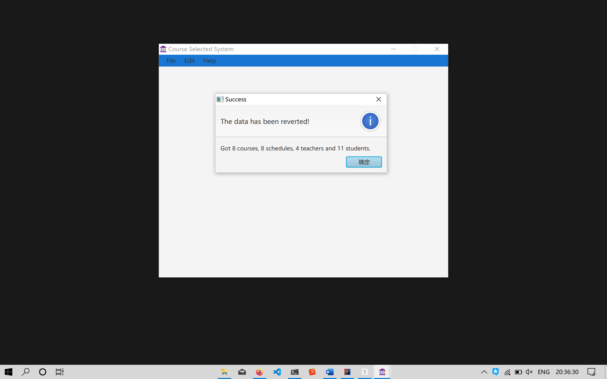
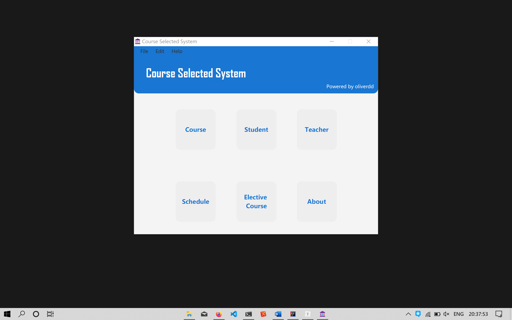
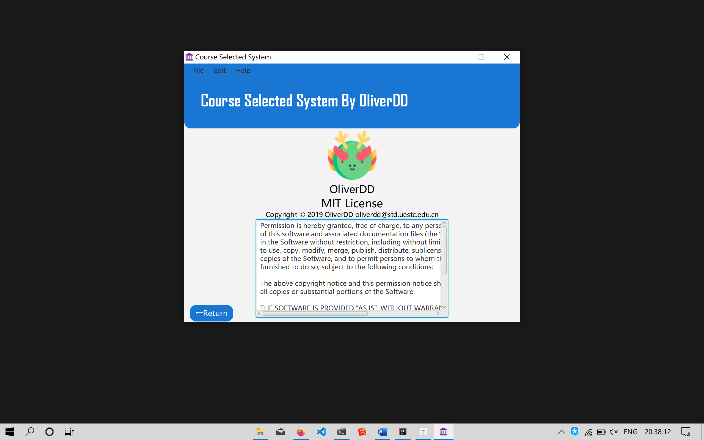
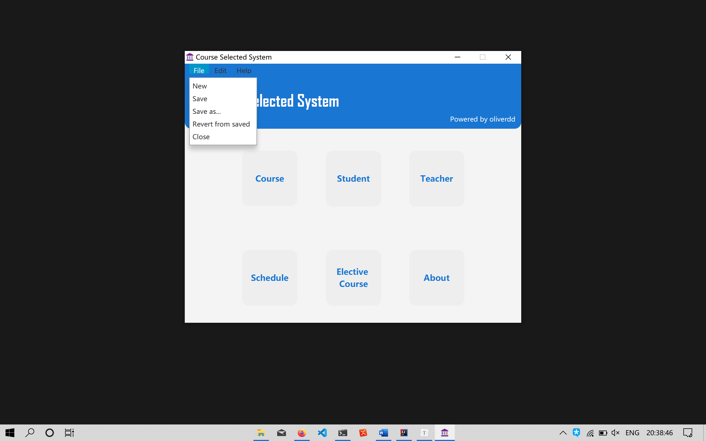
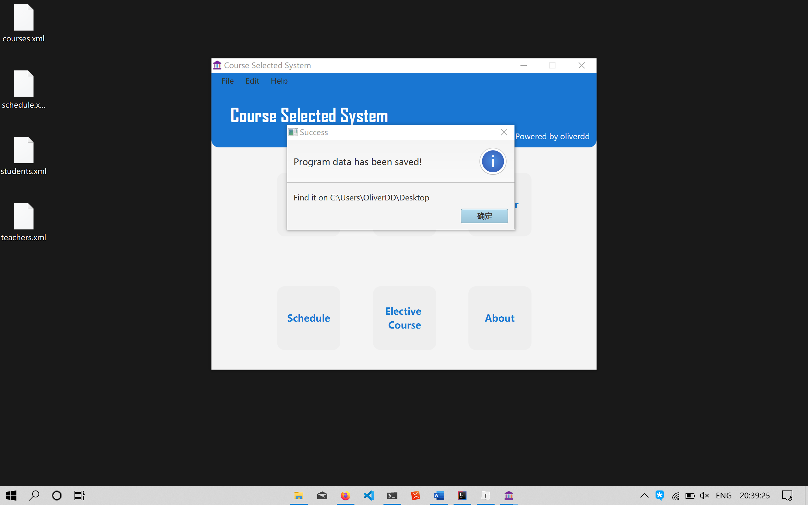
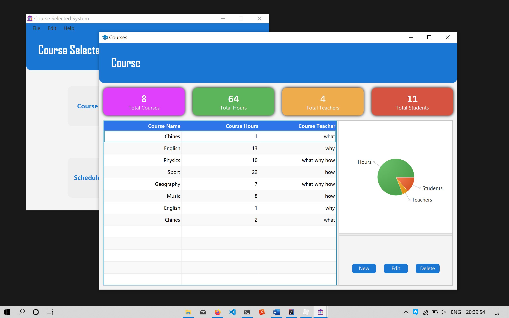
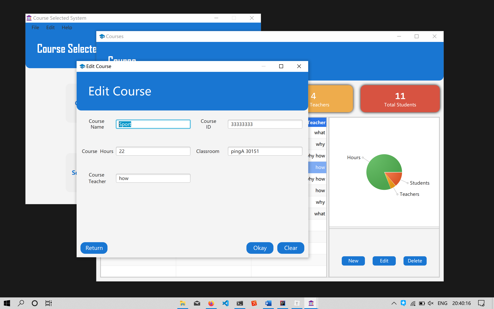

# Course Selected System

## License

[The MIT License (MIT)](https://oliverdd.coding.me/MIT.html)

Copyright © 2019 [OliverDD](https://qaqddbest.github.io) [oliverdd@std.uestc.edu.cn](https://oliverdd.coding.me/oliverdd@std.uestc.edu.cn)

## Firstly

* I build this application with purely javafx8, which means i didn't use any library at all. The Course Selected System is purely based on the javafx8.
* The application's interface refers to this [repository](https://github.com/k33ptoo/School-Management-System-JavaFX). But I **promise** that I **did not** copy any code from it.
* This application haven't been finished yet, since the works left behind is really a boring repetition.
* It was the first trial of my javafx application and desktop application, which means many bugs and not perfect. Please not be so strict at me, thanks!

## Preview

Opening up the application, you will see the application loading data and inform you a message just like this one:

Then you will see the main interface, which is called 'Home' like this one:

This one is About interface:

And this one for tool bar:

Click the Save as button, you will save the data to the folder you choose ...

Then follow the courses and edit course interface:

## Environment

1. Windows 1908 + oracle jdk 1.8
2. Manjaro + openjdk 1.8

Run in Intellij IDE.

## Installation

NO!

:smile:

Those code is really horrible that it should not be an running application.

## Advice

If you want to start your first javafx application, you can go to this [site](https://code.makery.ch/library/javafx-tutorial/).

And [this](https://github.com/marcojakob/tutorial-javafx-8) is it's code.